# PayFlow — Engineering Design Document (EDD)

**Status:** Phase 0 — Design approved pending sign-off. No implementation code exists yet.
**Version:** 0.1.0
**Owners:** Principal Engineering (single-team modular monolith)

---

## 1. Purpose & Scope

PayFlow is a **Payment Orchestration Platform**. It is not a payment gateway and it does not process card data. It sits between **merchants** (who integrate against PayFlow's API) and **payment providers** (Stripe, Razorpay, Adyen, PayPal — initially only a Mock Provider). PayFlow owns:

- A single, stable merchant-facing API regardless of which provider ultimately processes the transaction.
- The payment lifecycle state machine, idempotency guarantees, and the immutable financial ledger.
- Inbound reconciliation from providers and outbound event delivery to merchants.

This document is the system blueprint. It covers architecture, module boundaries, schema, API contracts, event flows, diagrams, ADR index, repository layout, coding standards, implementation roadmap, and risk analysis. It is written to be approved once, then referenced (and amended via new ADRs) throughout implementation.

### Non-Goals (v1)

- No real provider integrations (Stripe/Razorpay/Adyen/PayPal) — only the Mock Provider. The provider abstraction must make adding them a plug-in exercise, not a rewrite (see [ADR-006](adr/0006-provider-abstraction.md)).
- No subscriptions/recurring billing, disputes, multi-currency settlement, or platform fee splitting. These are explicitly deferred — see [§14 Future Extensibility](#14-future-extensibility) — but the schema and module boundaries are shaped so they don't force a rewrite.
- No PCI-scoped card data storage anywhere in PayFlow. Card capture is always delegated to the provider (hosted fields / provider tokenization). PayFlow only ever stores provider references and amounts.

---

## 2. System Architecture Overview

PayFlow core is a **Modular Monolith** (see [ADR-001](adr/0001-modular-monolith.md)) — one deployable Spring Boot application, internally partitioned by feature module with enforced package boundaries. The Mock Provider is deliberately a **separate deployable application**, because architecturally it must behave like an external, untrusted, network-attached system (its own latency, its own failure modes, its own webhook signing key) — collapsing it into the monolith would let the code cheat around problems real providers actually cause.

### 2.1 C4 — Level 1: System Context

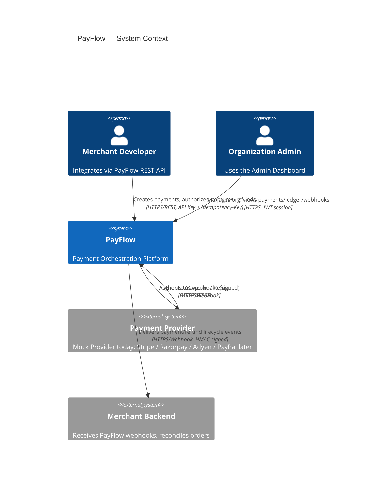

### 2.2 C4 — Level 2: Containers

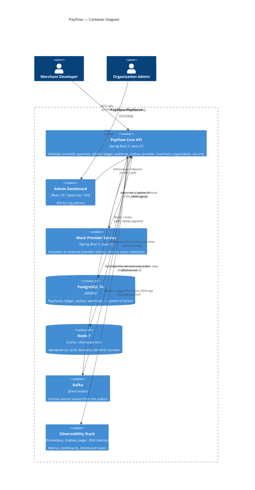

### 2.3 C4 — Level 3: Components (inside PayFlow Core API)

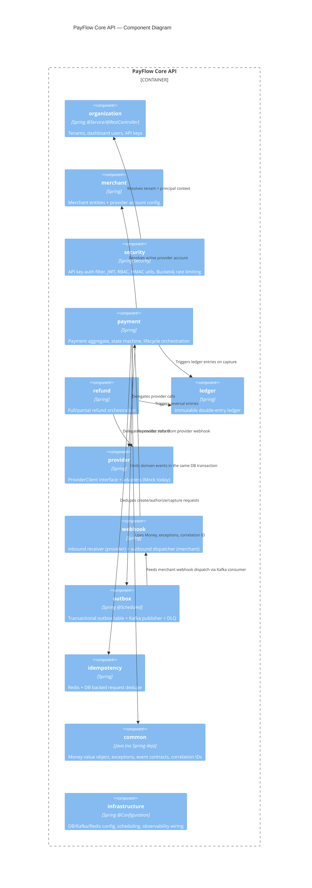

Module boundary rule: modules depend on each other **only through public interfaces and DTOs** exposed from a module's root package (e.g. `payment.api`), never by reaching into another module's internal `payment.internal` classes. This is enforced with ArchUnit tests (see [§9 Coding Standards](#9-coding-standards)).

---

## 3. Module Boundaries

| Module | Owns | Public interface (consumed by others) | Depends on |
|---|---|---|---|
| `organization` | Organizations, dashboard users, org membership, API keys | `OrganizationLookupService`, `ApiKeyValidationService`, `UserAuthenticationService` | `common` (password hashing uses the `spring-security-crypto` library directly, not the `security` module) |
| `merchant` | Merchants, provider account configs (credentials, defaults) | `MerchantLookupService`, `ProviderAccountResolver` | `organization`, `common` |
| `security` | Authn (API key + JWT), RBAC, HMAC sign/verify, rate limiting | `TenantContextHolder` accessor (type lives in `common`) | `organization`, `common` |
| `payment` | Payment aggregate + state machine + lifecycle use cases | `PaymentService`, `PaymentQueryService`, payment domain events | `provider`, `ledger`, `outbox`, `idempotency`, `merchant`, `common` |
| `refund` | Refund aggregate + lifecycle | `RefundService`, refund domain events | `payment`, `provider`, `ledger`, `outbox`, `common` |
| `ledger` | Ledger accounts, transactions, immutable entries | `LedgerService`, `LedgerQueryService` | `common` |
| `provider` | `ProviderClient` abstraction + adapters | `ProviderClient`, `ProviderRegistry` | `common` |
| `webhook` | Inbound provider receipt, outbound merchant delivery, DLQ | `InboundWebhookProcessor`, `WebhookEndpointService`, `WebhookDeliveryQueryService` | `security`, `outbox`, `common` |
| `outbox` | Outbox table, relay to Kafka, retry/poison handling | `OutboxWriter` (used inside the same DB transaction) | `common`, `infrastructure` |
| `idempotency` | Idempotency key cache + persistence | `IdempotencyGuard` | `common`, `infrastructure` |
| `common` | Money, domain exceptions, event contracts, correlation ID, pagination types, `TenantContext`/`TenantContextHolder` | — (leaf module, zero inbound dependency on others) | none |
| `infrastructure` | Cross-cutting config: DataSource, Flyway, Kafka, Redis, Bucket4j, OTel, Micrometer, scheduling | — | `common` |

Package-by-feature: every module is `com.payflow.core.<module>` with internal sub-packages `domain`, `application`, `api` (controllers/DTOs), `persistence` (JPA entities/repositories), and `internal` for anything not meant to leak out.

---

## 4. Database Schema

PostgreSQL 16, managed by Flyway migrations (`V1__init.sql`, `V2__...`, additive-only after v1.0 — see [ADR-003](adr/0003-postgresql.md)). All tenant-scoped tables carry `organization_id` directly (denormalized, not just reachable via join) so every repository query can enforce tenant isolation with a single indexed predicate — see [ADR-009](adr/0009-multi-tenancy-strategy.md).

### 4.1 Entity-Relationship Diagram

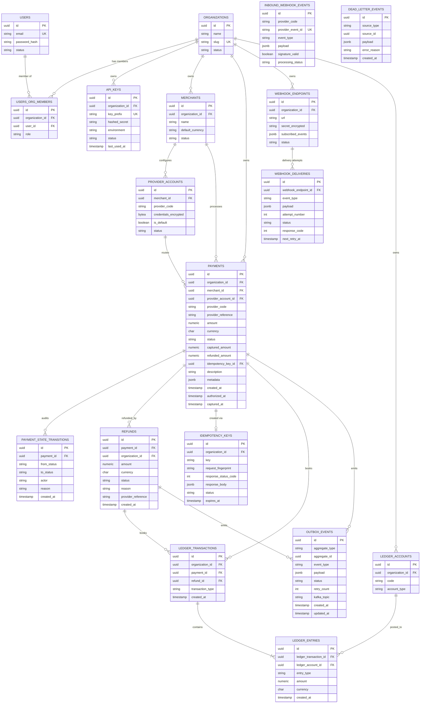

### 4.2 Table Notes

- **`payments.organization_id` / `refunds.organization_id`** are denormalized from `merchants`/`payments` respectively — every repository method that reads or writes these tables takes `organizationId` as an explicit parameter and includes it in the `WHERE` clause. There is no "trust the join" path to tenant data.
- **`ledger_entries` has no `updated_at` and no `UPDATE`/`DELETE` grant at the DB role level** for the application user — corrections are new reversing entries, never edits. See [ADR-008](adr/0008-double-entry-ledger.md).
- **`idempotency_keys`** is unique on `(organization_id, key)`. `status = IN_PROGRESS` rows represent an in-flight request; a concurrent duplicate with the same key while `IN_PROGRESS` returns `409 Conflict` (the caller should retry after a short backoff), while a duplicate with a completed matching fingerprint replays the stored response byte-for-byte.
- **`outbox_events`** is written in the *same transaction* as the business mutation (payment/refund/ledger row). A `@Scheduled` poller is the only writer that transitions `PENDING → PUBLISHED`/`FAILED`.
- Money is always `numeric(19,4)` at the DB boundary and `common.Money` (BigDecimal + currency) in Java — never `double`/`float`.

---

## 5. API Contracts

Full machine-readable contract is generated by springdoc-openapi from the controllers once implemented (served at `/v3/api-docs`, human UI at `/swagger-ui.html`) and exported to `docs/openapi.yaml` in CI. This section defines the contract at design time.

### 5.1 Merchant-facing API (API Key auth)

Base path: `/v1`. Auth: `Authorization: Bearer pf_live_<key>` resolved to an organization + rate-limit bucket. Mutating endpoints require `Idempotency-Key`.

| Method | Path | Purpose | Idempotent |
|---|---|---|---|
| POST | `/payments` | Create a payment intent (`CREATED`, no provider call yet) | Yes (header required) |
| POST | `/payments/{id}/authorize` | Ask the provider to authorize | Yes |
| POST | `/payments/{id}/capture` | Capture a previously authorized payment (full or partial capture amount) | Yes |
| GET | `/payments/{id}` | Fetch a payment, including state transition history | N/A (read) |
| GET | `/payments` | List payments (filter: `status`, `merchantId`, `createdAfter/Before`; cursor pagination) | N/A (read) |
| POST | `/payments/{id}/refunds` | Create a full or partial refund | Yes |
| GET | `/refunds/{id}` | Fetch a refund | N/A (read) |
| GET | `/ledger/entries` | List ledger entries for the org (filter: `paymentId`, date range) | N/A (read) |
| POST | `/webhook-endpoints` | Register a merchant webhook endpoint | Yes |
| GET | `/webhook-endpoints` | List registered endpoints | N/A (read) |
| DELETE | `/webhook-endpoints/{id}` | Disable an endpoint | N/A |
| GET | `/webhook-endpoints/{id}/deliveries` | Delivery history for an endpoint | N/A (read) |

**`POST /v1/payments`** — request:
```json
{
  "merchantId": "8f14e...",
  "amount": "149.00",
  "currency": "USD",
  "description": "Order #10432",
  "metadata": { "orderId": "10432" }
}
```
Response `201`:
```json
{
  "id": "pay_01HZY...",
  "status": "CREATED",
  "amount": "149.00",
  "currency": "USD",
  "merchantId": "8f14e...",
  "createdAt": "2026-07-06T10:15:00Z"
}
```

**`POST /v1/payments/{id}/authorize`** — request: `{}` (provider account resolved from merchant default, or `{"providerAccountId": "..."}` to override). Response `200`:
```json
{
  "id": "pay_01HZY...",
  "status": "AUTHORIZED",
  "providerReference": "mock_ch_9a12...",
  "authorizedAt": "2026-07-06T10:15:02Z"
}
```
`422` if the provider declines, with `status: "FAILED"` and `failureReason`.

**`POST /v1/payments/{id}/capture`** — request:
```json
{ "amount": "149.00" }
```
Response `200` with `status: "CAPTURED"` (or `PARTIALLY_REFUNDED`-adjacent fields untouched — capture and refund are separate axes). Triggers ledger posting synchronously in the same transaction as the state change.

**`POST /v1/payments/{id}/refunds`** — request:
```json
{ "amount": "50.00", "reason": "requested_by_customer" }
```
Omitting `amount` refunds the remaining captured balance in full. Response `201` with the refund resource; payment transitions to `PARTIALLY_REFUNDED` or `REFUNDED` depending on remaining balance.

**`POST /v1/webhook-endpoints`**:
```json
{ "url": "https://merchant.example.com/hooks/payflow", "subscribedEvents": ["payment.captured", "payment.refunded"] }
```
Response includes the endpoint id and a one-time-displayed `secret` used for HMAC verification (`X-PayFlow-Signature: t=<ts>,v1=<hex hmac-sha256>`), mirroring Stripe's signature header shape.

### 5.2 Admin Dashboard API (JWT session auth)

| Method | Path | Purpose |
|---|---|---|
| POST | `/v1/auth/login` | Email/password login, returns short-lived JWT + refresh token |
| GET | `/v1/dashboard/summary` | Volume, status breakdown, last 24h/7d/30d |
| GET | `/v1/dashboard/payments` | Recent payments (same data as merchant list API, dashboard-shaped) |
| GET | `/v1/organizations/{id}/api-keys` | List API keys (secrets never returned after creation) |
| POST | `/v1/organizations/{id}/api-keys` | Create a new API key (secret shown once) |
| DELETE | `/v1/organizations/{id}/api-keys/{keyId}` | Revoke a key |

### 5.3 Provider-facing API (Mock Provider service — separate app)

Simulates a real provider's public surface so the `ProviderClient` adapter talks to something realistic:

| Method | Path | Purpose |
|---|---|---|
| POST | `/provider/v1/charges` | Create + authorize a charge |
| POST | `/provider/v1/charges/{id}/capture` | Capture |
| POST | `/provider/v1/charges/{id}/refund` | Refund (full/partial) |

Every call has randomized latency (50–2000ms), a configurable failure rate, and — regardless of the synchronous response — fires an asynchronous signed webhook back to PayFlow's inbound endpoint (`POST /v1/webhooks/providers/mock`) shortly after, which is treated as the reconciliation source of truth (see [ADR-011](adr/0011-webhook-reconciliation.md)).

### 5.4 Inbound Provider Webhook

`POST /v1/webhooks/providers/{providerCode}` — unauthenticated by API key (providers don't have one), authenticated instead by HMAC signature verification against the provider account's shared secret. Payload:
```json
{
  "eventId": "evt_mock_88f...",
  "eventType": "charge.captured",
  "chargeId": "mock_ch_9a12...",
  "amount": "149.00",
  "currency": "USD",
  "occurredAt": "2026-07-06T10:15:05Z"
}
```
Deduplicated on `(provider_code, provider_event_id)`; out-of-order delivery is handled by treating the webhook as *confirming* a state the payment is expected to already be moving toward, not as a blind overwrite (see sequence diagram §7.2).

---

## 6. Event Catalog

Kafka topics are per-domain, partitioned by aggregate id for per-payment ordering. All events are relayed exclusively through the [Outbox](adr/0005-transactional-outbox.md) — application code never calls the Kafka producer directly.

| Topic | Partition key | Event types |
|---|---|---|
| `payflow.payments` | `payment_id` | `payment.created`, `payment.authorized`, `payment.authorization_failed`, `payment.captured`, `payment.capture_failed`, `payment.expired`, `payment.canceled` |
| `payflow.refunds` | `payment_id` | `refund.created`, `refund.succeeded`, `refund.failed` |
| `payflow.ledger` | `organization_id` | `ledger.transaction_recorded` |
| `payflow.webhooks.dlq` | `webhook_endpoint_id` | poison outbound deliveries after retry exhaustion |

Consumers: `WebhookDispatcher` (payments + refunds → merchant webhook delivery), `ReconciliationSweeper` (scheduled cross-check against provider state), future `AnalyticsProjector`.

---

## 7. Sequence Diagrams

### 7.1 Create → Authorize → Capture (happy path)

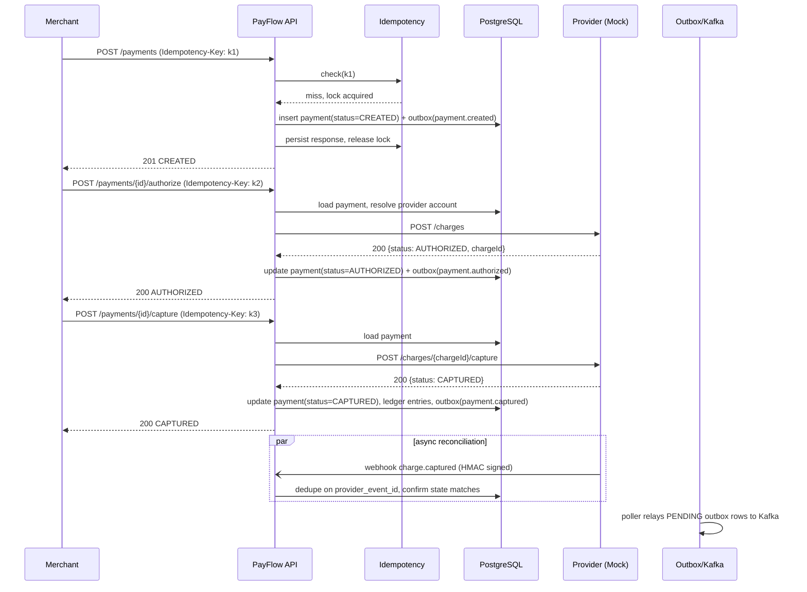

### 7.2 Provider Webhook Reconciliation (out-of-order / lost sync response)

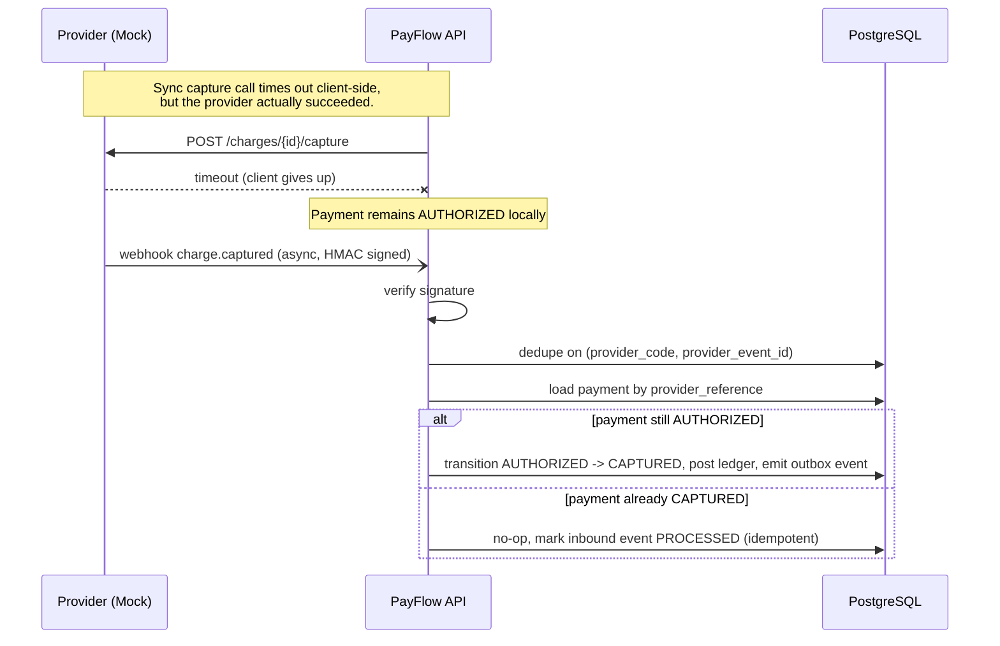

### 7.3 Refund (full/partial)

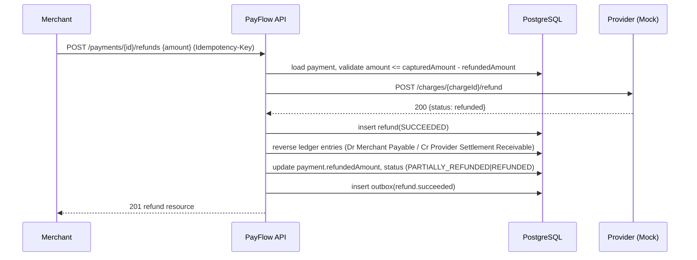

### 7.4 Transactional Outbox → Kafka Fan-out

```mermaid
sequenceDiagram
    participant SVC as Payment/Refund Service
    participant DB as PostgreSQL
    participant POLL as OutboxPublisher (scheduled)
    participant KFK as Kafka
    participant WHD as WebhookDispatcher (consumer)

    SVC->>DB: BEGIN; write aggregate row + outbox row(status=PENDING); COMMIT
    loop every 500ms
        POLL->>DB: SELECT ... WHERE status=PENDING ORDER BY created_at LIMIT 100 FOR UPDATE SKIP LOCKED
        POLL->>KFK: publish(topic, key=aggregate_id, payload)
        alt publish ok
            POLL->>DB: UPDATE status=PUBLISHED
        else publish fails
            POLL->>DB: UPDATE retry_count += 1
            Note over POLL,DB: after max_retries -> move to dead_letter_events
        end
    end
    KFK->>WHD: consume payflow.payments / payflow.refunds
    WHD->>WHD: look up subscribed webhook_endpoints, enqueue delivery
```

### 7.5 Merchant Webhook Delivery, Retry, DLQ

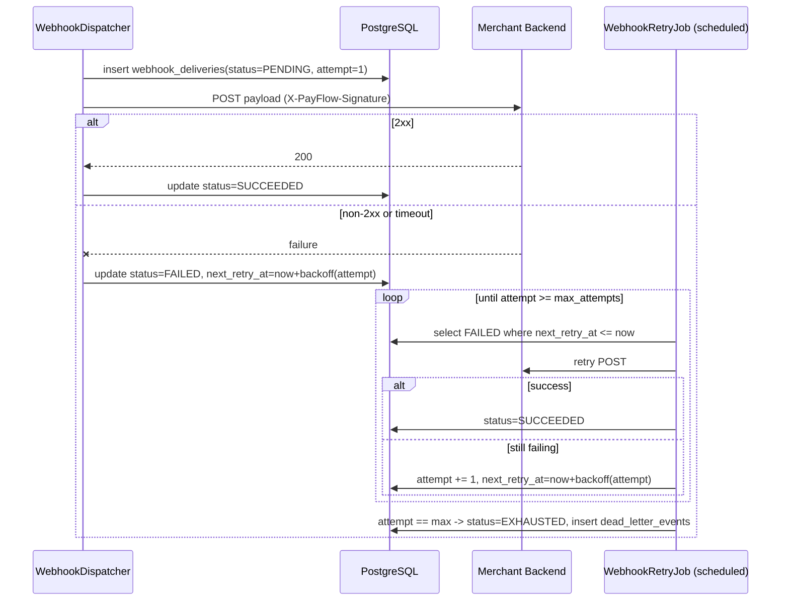

### 7.6 Idempotent Duplicate Request

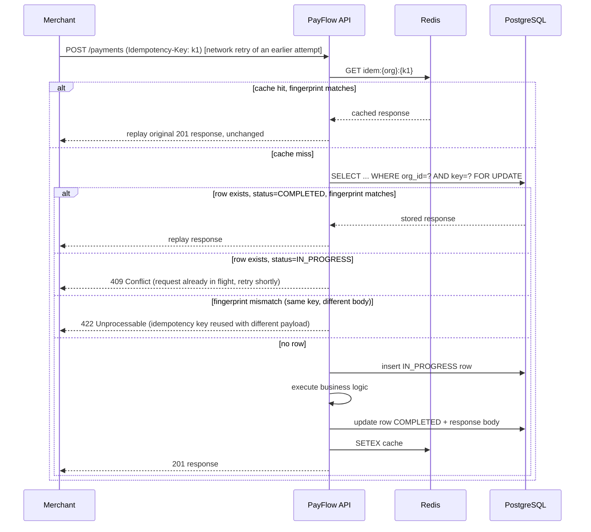

---

## 8. Payment State Machine

The spec calls for a simple core machine. We keep the **happy path exactly that simple**, and layer failure/expiry/partial-refund states around it rather than folding them into the four core states — this keeps `CREATED → AUTHORIZED → CAPTURED → REFUNDED` the mental model anyone reads first, while remaining correct for real failure modes.

**Core (as specified):**
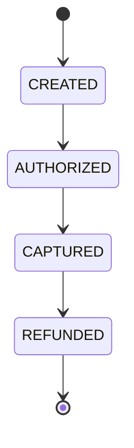

**Full (implemented):**
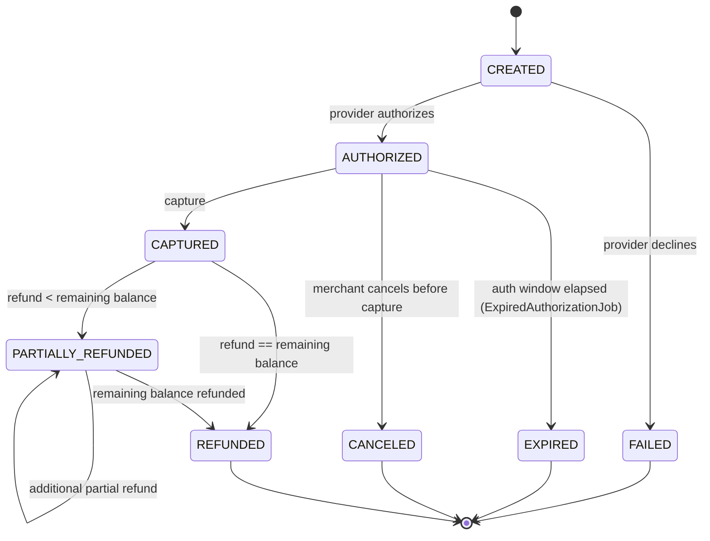

Every transition is written by `PaymentStateMachine.transition(payment, event, actor)`, which validates the edge is legal, persists the new status, and inserts a `payment_state_transitions` audit row **in the same transaction** — illegal transitions throw `IllegalPaymentTransitionException` (mapped to `409 Conflict`), never a silent overwrite.

---

## 9. Repository Structure

```
payflow/
├── backend/
│   ├── pom.xml                          # Maven reactor parent
│   ├── payflow-core/                    # the modular monolith
│   │   ├── pom.xml
│   │   └── src/main/java/com/payflow/core/
│   │       ├── PayflowCoreApplication.java
│   │       ├── organization/{domain,application,api,persistence}
│   │       ├── merchant/{domain,application,api,persistence}
│   │       ├── security/{...}
│   │       ├── payment/{domain,application,api,persistence}
│   │       ├── refund/{...}
│   │       ├── ledger/{...}
│   │       ├── provider/{domain,application,mock/}
│   │       ├── webhook/{inbound,outbound,api,persistence}
│   │       ├── outbox/{...}
│   │       ├── idempotency/{...}
│   │       ├── common/{money,exceptions,events,correlation}
│   │       └── infrastructure/{db,kafka,redis,ratelimit,observability,scheduling}
│   │       resources/
│   │         ├── application.yml, application-{dev,test,prod}.yml
│   │         └── db/migration/V1__init.sql, V2__..., ...
│   └── mock-provider-service/
│       ├── pom.xml
│       └── src/main/java/com/payflow/mockprovider/
├── frontend/
│   └── admin-dashboard/                 # React 18 + TS + Vite + Tailwind + React Query + Axios
│       ├── package.json
│       └── src/{pages,components,hooks,api,routes,lib}
├── infra/
│   ├── docker-compose.yml               # local dev: postgres, redis, kafka, prometheus, grafana, jaeger
│   ├── docker-compose.prod.yml
│   ├── nginx/
│   ├── prometheus/
│   ├── grafana/
│   └── otel-collector/
├── .github/workflows/ci.yml
├── docs/
│   ├── EDD.md                           # this document
│   └── adr/
├── CHANGELOG.md
└── README.md
```

Both `payflow-core` and `mock-provider-service` are Maven modules under one reactor so CI builds them together, but they ship as independent Docker images and independent Compose services — the reactor is a build-time convenience, not a runtime coupling.

---

## 10. Coding Standards (summary)

Full detail in [coding standards](#) (folded into this doc for v1; will split out if it grows past this section).

- **Package-by-feature**, not by layer. No `controllers/`, `services/`, `repositories/` at the top level.
- **Module isolation enforced by ArchUnit**: a test fails the build if module `X` imports `Y.internal.*`.
- **Entities vs DTOs are always distinct** — JPA entities never leave the `persistence` package; controllers only see `api` package request/response records.
- **Money** is always `common.Money` (BigDecimal + ISO currency), never primitive numeric types, from the DB column up through the API DTO.
- **Exceptions**: a domain exception hierarchy rooted at `PayFlowException`, mapped centrally by a `@RestControllerAdvice` to Stripe-style error bodies (`{"error": {"type": "...", "code": "...", "message": "...", "traceId": "..."}}`). No `catch (Exception e) { }` swallowing anywhere.
- **Validation** at the API boundary via Bean Validation (`jakarta.validation`); domain invariants (e.g. "refund amount ≤ remaining balance") enforced in domain code, not the controller.
- **Testing**: unit tests for domain/state machine logic (no Spring context), `@SpringBootTest` + Testcontainers (Postgres, Redis, Kafka) for integration tests exercising real infra. Every module ships both.
- **Correlation IDs**: an inbound `X-Correlation-Id` (or generated if absent) is placed in MDC at the edge, propagated through outbound provider calls and Kafka headers, and included in every structured log line and error response.
- **Commits**: Conventional Commits (`feat:`, `fix:`, `refactor:`, `docs:`, `chore:`). One focused change per commit. `CHANGELOG.md` updated alongside any user-visible change.
- **No TODOs, no placeholder methods, no commented-out code** merge to `main`. A milestone is either done or not started.

---

## 11. Implementation Roadmap

Milestones execute strictly in order; a milestone isn't "done" until its tests, docs, and CHANGELOG entry land together. Each will get its own detailed breakdown (goals / files / docs / commits) when it starts — this is the ordering and scope contract.

| # | Milestone | Scope |
|---|---|---|
| M0 | Bootstrap & tooling | Maven reactor, Docker Compose skeleton (Postgres/Redis/Kafka), Flyway baseline, GitHub Actions CI skeleton (build+test) |
| M1 | Tenancy & security core | `organization`, `merchant`, `security` — API key auth, JWT dashboard auth, RBAC, tenant context resolution |
| M2 | Payment lifecycle (sync) | `payment` module, state machine, Mock Provider skeleton with sync `/charges` endpoints; Create/Authorize/Capture |
| M3 | Idempotency | Redis + DB backed `idempotency` module wired into all mutating endpoints |
| M4 | Ledger | Immutable double-entry `ledger` module, posted synchronously on capture |
| M5 | Refunds | `refund` module, full/partial, ledger reversal |
| M6 | Outbox + Kafka | `outbox` module, scheduled relay, topics from §6 |
| M7 | Inbound webhooks + reconciliation | Mock Provider async webhook, signature verification, reconciliation logic from §7.2 |
| M8 | Outbound webhooks | Merchant `webhook_endpoints`, HMAC signing, delivery + retry + DLQ |
| M9 | Scheduled jobs | Expired authorization sweep, webhook retry job, outbox cleanup, idempotency key cleanup, reconciliation sweeper |
| M10 | Observability | Micrometer + Prometheus + Grafana dashboards, OpenTelemetry + Jaeger tracing, structured JSON logs, correlation IDs, health checks, business metrics |
| M11 | Mock Provider hardening | Configurable latency/failure/retry simulation profiles |
| M12 | Admin dashboard | Dashboard summary, payment list/detail, state timeline, ledger view, webhook history, refund action, live metrics |
| M13 | Deployment | Production Docker Compose, Nginx + SSL, GitHub Actions CI/CD, deployment guide |
| M14 | Documentation & release polish | ADR completeness check, README finalization with screenshots, CHANGELOG, `v1.0.0` tag |

---

## 12. Risk Analysis

| Risk | Impact | Mitigation |
|---|---|---|
| Dual-write inconsistency (DB write succeeds, Kafka publish lost) | Merchant never notified of a captured payment | Transactional Outbox — event row committed atomically with the business row; publish is a separate, retried, at-least-once step ([ADR-005](adr/0005-transactional-outbox.md)) |
| Duplicate payment/refund from client retries | Double-charge / double-refund | Stripe-style idempotency, DB-persisted with `FOR UPDATE` locking, Redis as a fast-path cache only ([ADR-007](adr/0007-idempotency-strategy.md)) |
| Ledger corruption from concurrent captures/refunds on the same payment | Books don't balance, financial reporting wrong | Row-level lock on `payments` during state transition + append-only `ledger_entries` with a DB check constraint that each `ledger_transaction_id` group nets to zero per currency ([ADR-008](adr/0008-double-entry-ledger.md)) |
| Tenant data leakage across organizations | Compliance / trust failure, could be catastrophic for a fintech product | `organization_id` denormalized onto every tenant-scoped table + repository methods that structurally require it as a parameter + integration tests asserting cross-tenant reads return empty ([ADR-009](adr/0009-multi-tenancy-strategy.md)) |
| Provider credential exposure | Stolen credentials used against real provider accounts | `provider_accounts.credentials_encrypted` envelope-encrypted at rest; never logged; never returned by any API response |
| Merchant-supplied webhook URL used for SSRF | Internal network access via a proxied outbound call | URL validation on registration (public DNS resolution required, block RFC1918/loopback/link-local ranges), outbound HTTP client denies redirects to private ranges |
| Retry storms against a struggling merchant endpoint or provider | Cascading failures, self-inflicted DoS | Exponential backoff with jitter on both webhook delivery retries and provider client retries; circuit breaker around `ProviderClient` |
| Poison messages stuck retrying forever | Outbox/webhook backlog grows unbounded | Max retry count on both outbox rows and webhook deliveries, then move to `dead_letter_events` / `EXHAUSTED` with dashboard visibility, never silently dropped |
| Kafka topic ordering assumptions violated | Events for one payment processed out of order downstream | Partition key = aggregate id (`payment_id`) guarantees per-payment ordering within a partition; consumers are still written idempotently as defense in depth |
| Clock skew affecting idempotency key / auth expiry windows | Premature expiry or key reuse window drift | Server-side timestamps only (never client-supplied) for all expiry logic; NTP-synced hosts assumed at deploy time |
| Redis unavailability | Idempotency/rate-limiting degraded | DB is the durable source of truth for idempotency (Redis is cache-only); rate limiting fails open with a conservative fallback limit rather than rejecting all traffic |
| Scope creep into card data handling | PCI-DSS scope explosion | Architectural rule: PayFlow never receives raw PAN/CVV in any request body; enforced by API contract (no such field exists) and documented as a hard boundary, not a convention |

---

## 13. ADR Index

See [docs/adr/README.md](adr/README.md) for the full list. Key decisions:

- [ADR-001](adr/0001-modular-monolith.md) — Modular Monolith over Microservices
- [ADR-002](adr/0002-kafka-event-streaming.md) — Kafka for Event Streaming
- [ADR-003](adr/0003-postgresql.md) — PostgreSQL as Primary Datastore
- [ADR-004](adr/0004-redis.md) — Redis for Idempotency Cache & Rate Limiting
- [ADR-005](adr/0005-transactional-outbox.md) — Transactional Outbox Pattern
- [ADR-006](adr/0006-provider-abstraction.md) — Provider Abstraction via Adapter Interface
- [ADR-007](adr/0007-idempotency-strategy.md) — Stripe-style Idempotency Key Design
- [ADR-008](adr/0008-double-entry-ledger.md) — Immutable Double-Entry Ledger
- [ADR-009](adr/0009-multi-tenancy-strategy.md) — Multi-Tenancy via Row-Level Organization Scoping
- [ADR-010](adr/0010-authentication-strategy.md) — API Keys (merchants) + JWT (dashboard)
- [ADR-011](adr/0011-webhook-reconciliation.md) — Webhooks as Reconciliation Source of Truth
- [ADR-012](adr/0012-observability-stack.md) — Observability Stack Selection

---

## 14. Future Extensibility

The design decisions above are shaped so these additions don't require touching the module boundaries:

- **Real providers (Stripe/Razorpay/Adyen/PayPal)**: implement `ProviderClient`, register in `ProviderRegistry` under a new `provider_code`. No change to `payment`/`refund`/`ledger`.
- **Disputes**: new `dispute` module consuming `payflow.payments` events + a new inbound webhook event type; ledger already supports arbitrary reversing entries.
- **Subscriptions/recurring billing**: a new `subscription` module that creates `Payment`s on a schedule — reuses the entire lifecycle, idempotency, and ledger machinery unchanged.
- **Multi-currency settlement**: `ledger_accounts` and `ledger_entries` are already currency-scoped per row; settlement adds a new account type and a scheduled settlement job, not a schema rewrite.
- **Platform fees**: a third ledger entry per capture (`Dr Merchant Payable / Cr Platform Fee Revenue`) — the ledger transaction model already supports N-way balanced entries, not just two.
- **Analytics**: `AnalyticsProjector` Kafka consumer on existing topics; no producer-side change.

---

*End of Engineering Design Document. Implementation begins at M0 upon sign-off.*
